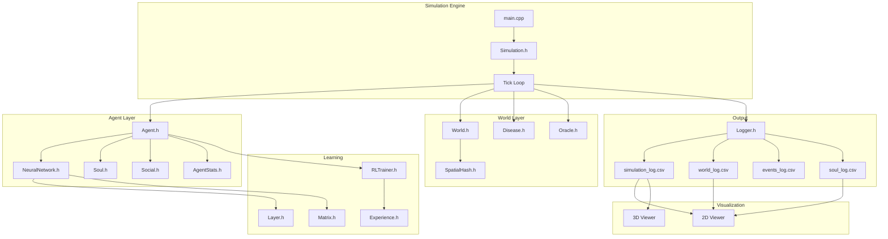

# EvoSim — System Architecture

Technical deep-dive into the simulation engine, data flow, and key algorithms.

## High-Level Architecture



## Tick Cycle

Each simulation tick represents one "year" and executes this pipeline:

```
1. Update World
   ├── Advance season (every 100 ticks)
   ├── Regrow resources
   ├── Spawn predators
   └── Apply cultural movements

2. For each Agent:
   ├── Build sensor input vector (11 floats)
   ├── Forward pass through neural network → 19 action probabilities
   ├── Check Sin Override (libido, hunger, thirst)
   ├── Execute chosen action
   ├── Calculate reward signal
   ├── Train neural network (backprop)
   ├── Store experience in replay buffer
   ├── Update soul (karma, alignment, enlightenment)
   ├── Age + apply biome effects
   ├── Check death conditions
   └── Attempt reproduction if eligible

3. Disease tick
   ├── Spread infection to nearby agents
   └── Advance infection timers

4. Spatial hash rebuild
   └── Re-index all agents by grid position

5. Logging
   ├── Log all agent stats to CSV
   ├── Log world stats to CSV
   └── Log notable events
```

## Module Details

### Agent Decision Pipeline

```
Sensors (11 inputs):
  ├── health, energy, satiety (normalized 0-1)
  ├── local food density
  ├── local water density
  ├── neighbor count
  ├── nearest predator distance
  ├── kinship level
  ├── age (normalized)
  ├── current biome (encoded)
  └── libido (biological imperative)

Neural Network:
  ├── Input: 11 neurons
  ├── Hidden: 32 neurons (ReLU)
  ├── Hidden: 24 neurons (ReLU)
  └── Output: 19 neurons (softmax → action probabilities)

19 Actions:
  MOVE_UP, MOVE_DOWN, MOVE_LEFT, MOVE_RIGHT,
  EAT, DRINK, ATTACK, FLEE,
  COOPERATE, TRADE, COMMUNICATE, REST,
  HUNT, BUILD_SHELTER,
  QUERY_ORACLE, PRAY,
  MATE, INVENT, FORM_TRIBE
```

### Soul System

Souls track an agent's spiritual journey:

- **Karma** — Modified by actions: cooperation (+3), trading (+2), attacking (-5), building (+5)
- **Alignment** — Order ↔ Chaos spectrum (-1 to +1). Cooperation → order, attacking → chaos
- **Enlightenment** — Progress to transcendence (0-100%). Oracle queries, prayer, and Tree of Knowledge advance it
- **Archetype** — Determined by dominant stats: highest of curiosity (Explorer), strength (Warrior), altruism (Healer), intelligence (Thinker), status (Builder), enlightenment (Prophet)
- **Reincarnation** — On death, souls respawn with 20% karma carry-over and incremented soul age

### Social System

**Tribes:**
- Created when an agent with 2+ nearby neighbors chooses FORM_TRIBE
- Names procedurally generated (prefix + suffix: "Stormweavers", "Moonkeepers")
- Members share territory coordinates and collective karma
- Tribemates get bonus kinship from trading

**Cultural Memes:**
- Created by curious agents (curiosity > 50) who choose COMMUNICATE
- Three categories: technique (curiosity bonus), belief (altruism + karma bonus), tradition (altruism bonus)
- Spread to nearby agents within range 3
- Track spread count for viral analysis

### Spatial Hashing

Grid-based spatial partitioning for O(1) neighbor lookups:

```
Cell size = 5 (configurable)
Grid dimensions = world_size / cell_size

insert(agent):
    cell_x = agent.x / cell_size
    cell_y = agent.y / cell_size
    cells[cell_x][cell_y].push(agent)

query(x, y, range):
    for each cell within range of (x, y):
        for each agent in cell:
            if distance(agent, query_point) <= range:
                add to results
```

This reduces neighbor searches from O(N²) to O(N × K/N) where K is agents per cell.

### Disease Mechanics

- **Spawn**: Random chance per tick when population > threshold
- **Spread**: Infected agents transmit to neighbors within range 2 (20% chance)
- **Duration**: Infection lasts 30-50 ticks
- **Effects**: Health drain per tick, reduced energy
- **Immunity**: Recovered agents get temporary immunity

### Neural Network Training

Q-learning with experience replay:

```
reward = Σ(stat_deltas × weights)
         + survival_bonus
         + karma_change × 0.5
         - death_penalty

loss = (target_Q - predicted_Q)²
target_Q = reward + γ × max(Q(s', a'))

Learning rate: 0.001
Discount factor (γ): 0.95
Replay buffer: 1000 experiences
Batch size: 32
```

## CSV Data Schema

### simulation_log.csv
| Column | Type | Description |
|--------|------|-------------|
| ID | int | Agent unique ID |
| Tick | int | Current simulation year |
| X, Y | int | Grid position |
| Health, Energy, Satiety | float | Vital stats (0-100) |
| Kinship, Status, Curiosity, Altruism | float | Social/psychological stats |
| Intel | float | Intelligence |
| Age, Gen | int | Agent age, generation number |
| Biome | string | Current biome name |
| Archetype | string | Soul archetype |
| Karma, Alignment, Enlightenment | float | Soul metrics |
| SoulAge | int | Reincarnation count |
| TribeId | int | Tribe affiliation (-1 = none) |
| NumMemes | int | Cultural memes held |

### world_log.csv
| Column | Type | Description |
|--------|------|-------------|
| Tick | int | Simulation year |
| Pop | int | Living agent count |
| Infected | int | Diseased agents |
| Dead | int | Cumulative deaths |
| AvgAltruism, AvgCuriosity, AvgConsciousness | float | Population averages |

### soul_log.csv
| Column | Type | Description |
|--------|------|-------------|
| Tick | int | Year of death |
| AgentID | int | Agent ID |
| Archetype | string | Soul archetype at death |
| Karma | float | Final karma |
| Alignment | float | Final alignment |
| Enlightenment | float | Final enlightenment |
| SoulAge | int | Reincarnation count |
| CauseOfDeath | string | How the agent died |
| Age | int | Age at death |
| LifeEvents | string | Pipe-separated biography |
